# Hotel Booking App 

Hotel Booking App is a web based hotel room reservation system.
[Download Source]  (<https://github.com/alameenboss/hotel-booking-app/archive/refs/heads/main.zip>)

## Instruction

* Username: superadmin@gmail.com (default adminuser)

* Password: Test@123

* You can register a new user with email and password , email confirmation link will be generated and written C:\TEMP\confirmemail.html instead of sending email . Login with super admin and go to the user list page and make other user Admin if required

* Guest can register with google external login. 

* Any user can be made as admin by another admin

* Create Room as admin as required

* Db configuration are in API project -> appsettings.json

## Features

* User Registeration,Password Reset,Confirm Password,Change Password
* Google Authentication
* Role Based Authization
* Room List, Add Room, Edit Room, Delete Room (Admin)
* Show Room Avalability Status for Admin on a given Date (Admin)
* List Register user , and make them admin (Admin)
* Search Room By Room Type & Date Range (Guest)
* Book Available Room (Guest)
* List Booking History (Guest)

## Technology Used

### Front End

* Angular 11
* Bootstarp 5
* NgxAlert
* NgxProgress
* NgBootstrap for Data Control
* Google Authentication

### API

* Dotnet Core 3.1 Web API
* Identity Server For Authentication and Authorization 
* Entity Framework
* JWT Token Generation,Validation
* Onion Architecture
* Swagger UI

## Migration commands

### Add Migration
`Add-Migration -Name "RenamedColumns" -OutputDir "EFCore\Migrations" -Project "HotelBooking.Data.Repository"`

### Add Migration
`Update-Database`

## Screens

### Home

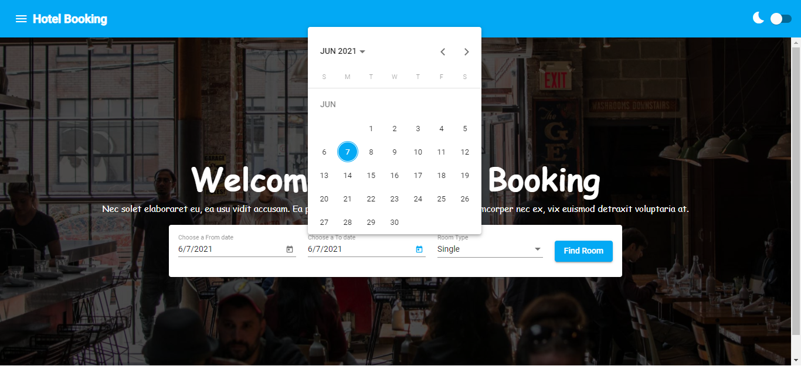
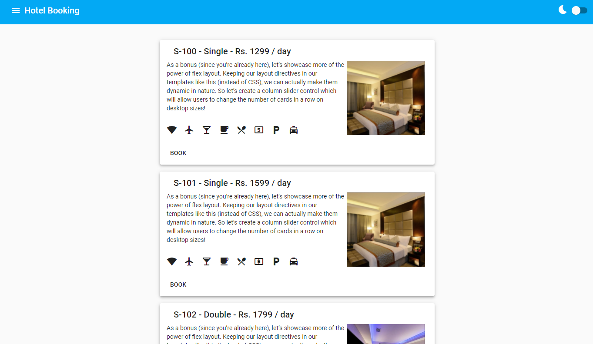

### Login

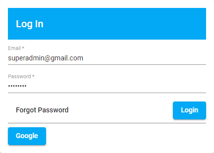

### Register

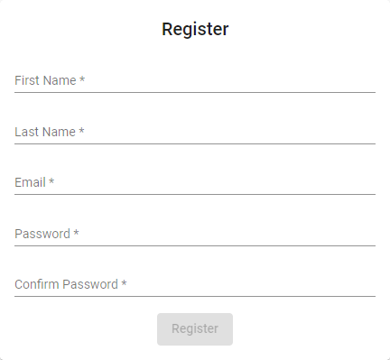

### Forgot Password

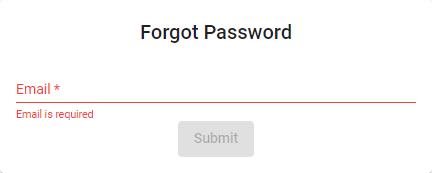

### Dashboard - Admin

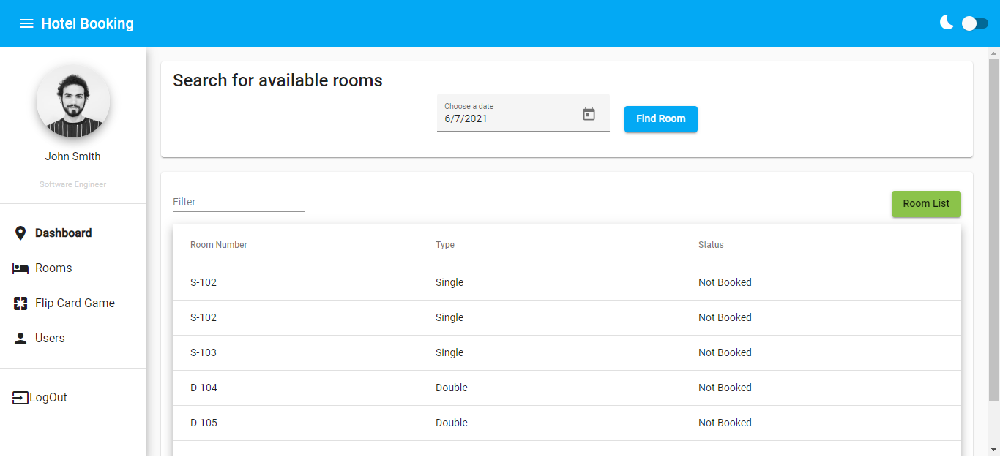

### Dashboard DarkMode - Admin

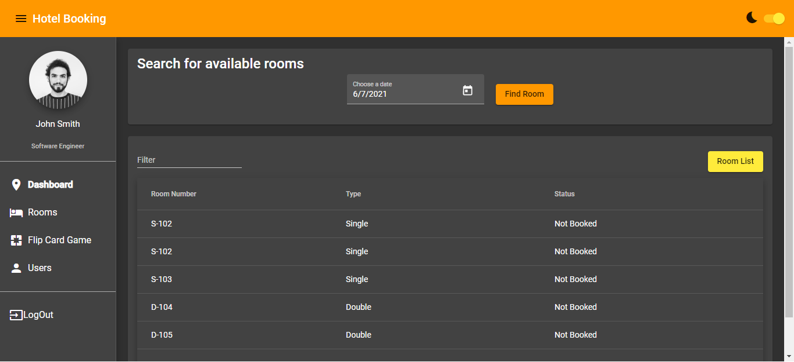

### RoomList - Admin

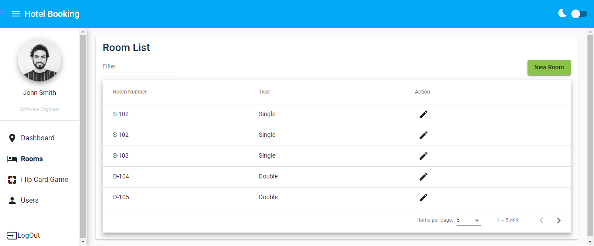

### AddRoom - Admin

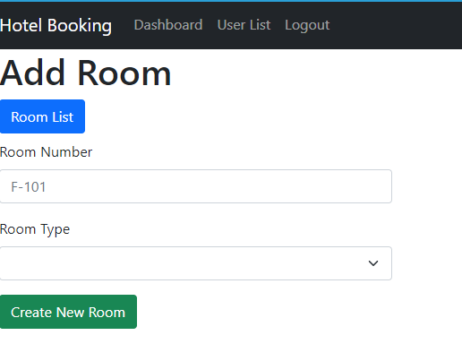

### Edit Delete Room - Admin

### User List - Admin

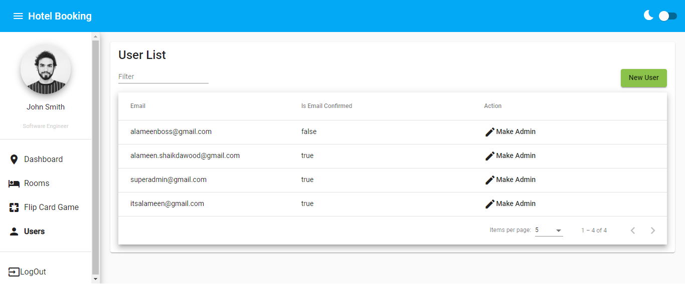

### Search and Book Room - Customer

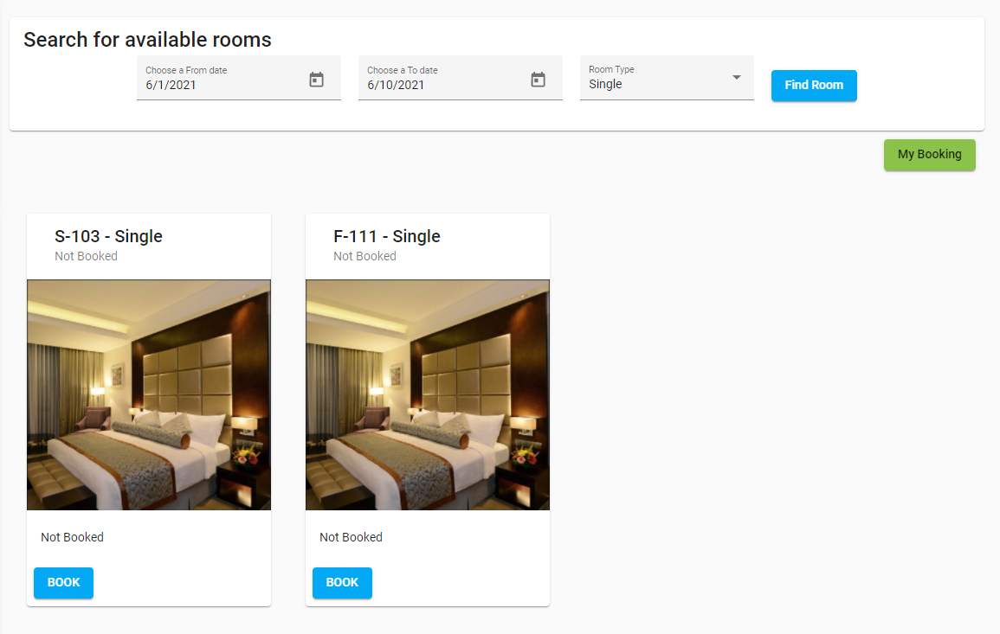

### My Booking

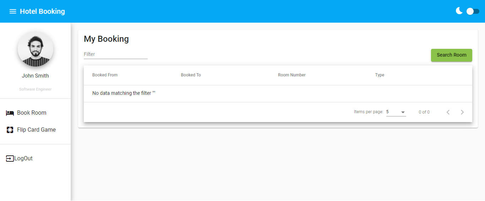

### Swagger_API

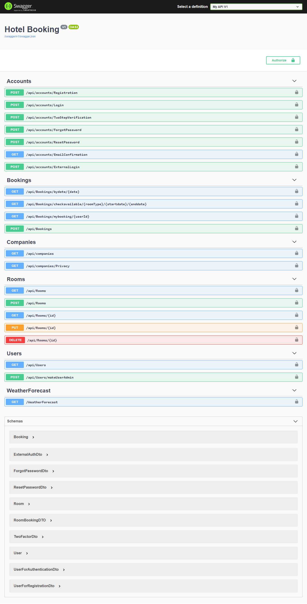

### JWT_Authentication

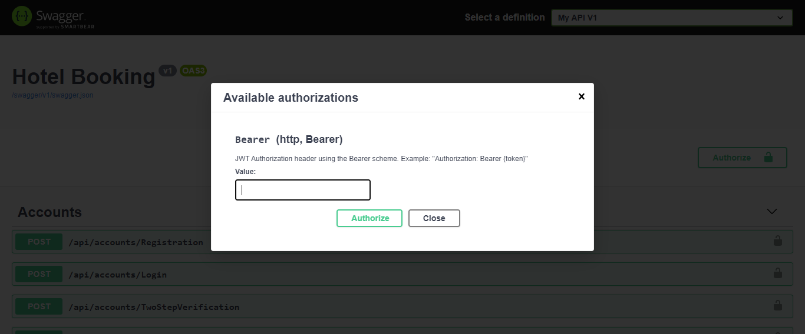

### Flip Card Game

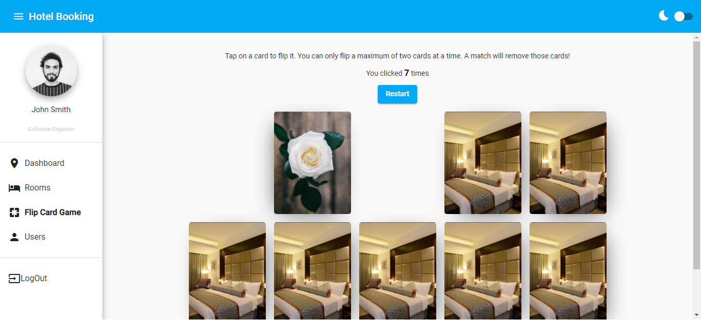